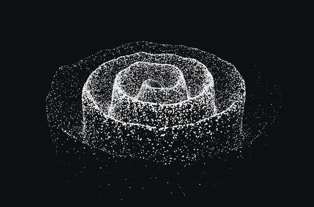

# Reasciiary

<p align="center"></p>

Reasciiary is a Tauri desktop app (Rust backend, TypeScript and Vite front end) that turns images and drawings into lit 3D ASCII art and animated loops. Six tools and one exporter for making a picture into another picture.

A flat file gets its third dimension from ink: a glyph that fills more of its cell stands taller (`@` rises, `.` barely lifts, a space is a hole), so a drawing lifts into a solid that can be lit and turned. A picture is the same rule with light read in place of ink.

## The six tools

| Tool | |
| --- | --- |
| `loops` | a finished piece that comes back round to where it began |
| `ascii` | a drawing or picture lifted into a solid, ink for height |
| `scene` | a sphere, torus, cube or knot cut from a formula and turned |
| `media` | a drawing, picture or animation read flat as glyphs |
| `gen2d` | a flow field drawn in pixels and read back as glyphs |
| `spiral` | a wave winding out from the middle, drawn by one spiralling line |

Every tool exports to an MP4, a GIF, a PNG or text.

## What you need

- [Bun](https://bun.sh) to install and run the front end.
- A Rust toolchain (`cargo`) for the backend and the command line.
- `ffmpeg`, only for GIF and MP4 exports (PNG and TXT need nothing): `brew install ffmpeg`.

## Running it

```sh
bun install
bun run tauri dev
```

The window opens on a drawing that ships with it, so there is something to turn straight away. Drag the preview to turn a solid, scroll to zoom, double-click to face it head-on. The toolbar picks the tool; the panel beside the preview holds that tool's own options, with what the export writes at the foot of it.

## Command line

The same pipeline, driven by a typed line. The whole line is one quoted argument, because the `>` belongs to the command language rather than to the shell:

```sh
cargo run --bin reasciiary -- "ascii logo.txt --depth 12 --turns 3 > out.mp4"
```

A line is a source, the filters it flows through, and where the result lands. The extension after `>` picks the format: `mp4`, `gif`, `png` or `txt`.

```sh
# a knotted tube, turned twice, as a looping GIF
cargo run --bin reasciiary -- "scene --shape knot --turns 2 > knot.gif"

# a photo laid on the spiral disc, read from a low pitch
cargo run --bin reasciiary -- "spiral portrait.png --pitch 15 > portrait.mp4"

# a sketch read flat, graded to nine shades, as text
cargo run --bin reasciiary -- "media sketch.png --marks shades > sketch.txt"
```

## Going deeper

The full flag reference for every tool and the design notes live in [docs/DESIGN.md](docs/DESIGN.md).

## Links

- Live page: https://latent-9.github.io/reasciiary-ascii-art-generator/
- Source: https://github.com/latent-9/reasciiary-ascii-art-generator

## License

Reasciiary is released under the MIT License. See [`LICENSE`](LICENSE).

The font is [JetBrains Mono](https://github.com/JetBrains/JetBrainsMono), under the SIL Open Font License. See `src-tauri/assets/OFL.txt`.
